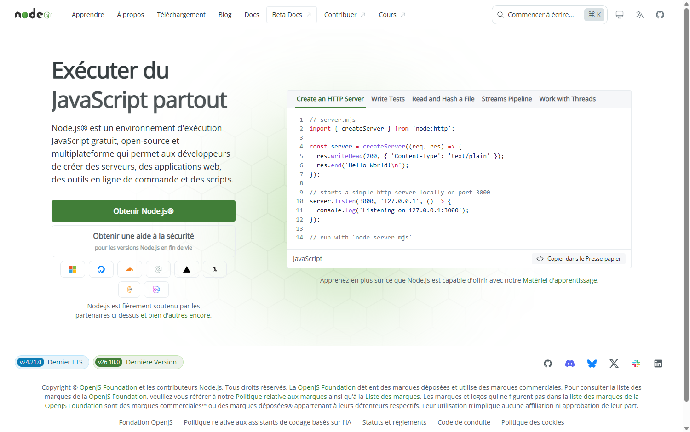

# Guide pas à pas

Ce guide s'adresse à quelqu'un qui n'a jamais installé de logiciel de développeur et qui n'a jamais ouvert un terminal. Si vous savez déjà ce qu'est npm, le [README](README.md) ira plus vite.

Comptez trois quarts d'heure la première fois, dont la moitié en téléchargements.

---

## À quoi ça sert, concrètement

Vous déposez votre CV dans un dossier. Vous dites à Claude quel poste et quelle ville vous cherchez. Il ouvre un navigateur sous vos yeux, parcourt HelloWork et Indeed, lit les annonces une par une et garde celles qui correspondent vraiment à votre CV, avec une note sur 100 et une explication. Vous obtenez une liste triée, un tableau pour suivre vos candidatures, et des lettres de motivation rédigées à partir de votre seul CV.

Rien ne part sur Internet à part les pages d'annonces que le navigateur consulte. Votre CV reste sur votre ordinateur.

**Ce que ça ne fait pas :** ça ne postule pas à votre place. Vous gardez la main sur chaque envoi.

---

## Ce que ça coûte

Un abonnement Claude Pro, autour de 20 € par mois, résiliable. C'est la seule dépense. Tout le reste est gratuit.

Une recherche d'une vingtaine d'annonces consomme une partie de votre quota mensuel. En pratique vous pouvez lancer plusieurs recherches par semaine sans y penser.

---

## Étape 1 : le compte Claude

Allez sur [claude.ai](https://claude.ai), créez un compte, puis prenez l'abonnement **Pro** dans les réglages. Le forfait gratuit ne suffit pas : il ne donne pas accès à Claude Code.

## Étape 2 : installer Claude Code

Rendez-vous sur [claude.com/product/claude-code](https://claude.com/product/claude-code) et téléchargez l'application pour votre système. Installez-la comme n'importe quel logiciel, puis ouvrez-la et connectez-vous avec le compte de l'étape 1.

L'application de bureau est plus simple que la version en ligne de commande. Si vous préférez cette dernière, le README explique comment faire.

## Étape 3 : installer Node.js

Node est le moteur qui fait tourner le skill. Sans lui, rien ne démarre.

Allez sur [nodejs.org](https://nodejs.org/fr) et cliquez sur le gros bouton vert **Obtenir Node.js**. Choisissez la version marquée **LTS** et non la dernière version.



Lancez le fichier téléchargé, cliquez sur Suivant jusqu'au bout. Aucune option à changer.

**Important :** si Claude Code était ouvert, fermez-le et rouvrez-le. Sinon il ne verra pas Node.

## Étape 4 : installer Google Chrome

Si vous ne l'avez pas déjà : [google.com/chrome](https://www.google.com/chrome/). C'est le navigateur que Claude pilotera pendant la recherche. Vous le verrez s'ouvrir et défiler les annonces.

## Étape 5 : installer les skills

Ouvrez Claude Code et tapez ces trois lignes, une par une, en appuyant sur Entrée à chaque fois :

```text
/plugin marketplace add Sayn78/claude-emploi
/plugin install recherche-emploi@claude-emploi
/plugin install audit-cv-ats@claude-emploi
```

Une quatrième, facultative mais recommandée, pour que les lettres ne sonnent pas comme un robot :

```text
/plugin install humanizer@claude-emploi
```

Puis **fermez Claude Code et rouvrez-le**. C'est à ce moment que les skills deviennent actifs.

> Si vous ne trouvez pas où taper ces commandes : c'est dans la zone de saisie, là où vous écrivez normalement vos messages. La barre oblique au début fait apparaître une liste de suggestions.

## Étape 6 : votre dossier de travail

Créez un dossier quelque part, nommé par exemple `recherche-emploi`, dans vos Documents. Laissez-le vide.

Dans Claude Code, ouvrez ce dossier : l'application vous demande sur quel dossier travailler au démarrage, ou propose un bouton pour en changer. C'est important, tout se passera là-dedans.

## Étape 7 : c'est parti

Tapez :

```text
/recherche-emploi
```

Claude prend la main. Il vérifie que tout est en place, crée ce dont il a besoin et ouvre une page dans votre navigateur, à l'adresse `localhost:3000`. C'est votre tableau de bord.

Il vous demande alors de déposer votre CV en PDF dans le dossier `cv` qu'il vient de créer, avec un bouton qui vous ouvre ce dossier. Glissez-y votre CV, revenez dans le chat de la page, cliquez sur **C'est fait**.

À partir de là, tout se passe dans la page : Claude pose ses questions, vous répondez en cliquant.


---

## Si quelque chose ne marche pas

Le tableau de bord a un bouton **Vérifier les dépendances**. Il affiche une case par élément nécessaire : vert tout va bien, rouge il manque quelque chose, et la case vous dit quoi.


| Ce que vous voyez | Ce qu'il faut faire |
| --- | --- |
| Case **Node.js** rouge | Refaites l'étape 3, puis fermez et rouvrez Claude Code |
| Case **Playwright MCP** rouge | Fermez et rouvrez Claude Code. Le serveur est livré avec le skill, mais il n'apparaît qu'au redémarrage |
| Case **Google Chrome** rouge | Refaites l'étape 4 |
| Case **Dossier cv/** rouge | Il manque votre CV en PDF dans le dossier `cv` |
| Case **Watcher** rouge | Votre session Claude Code s'est arrêtée. Relancez `/recherche-emploi` |
| Case **Skill humanizer** rouge | Facultatif. Les lettres se feront quand même, un peu moins naturelles |
| **Claude hors ligne** en haut de la page | Même chose : la session est fermée, relancez le skill |
| Une page qui demande « Êtes-vous un humain ? » | Résolvez-la vous-même dans la fenêtre du navigateur, puis dites à Claude de reprendre. Il ne la contournera jamais tout seul |

Si un message d'erreur vous échappe, collez-le simplement dans le chat de Claude Code et demandez ce que ça veut dire. C'est exactement à ça qu'il sert.

---

## Trouver un emploi, la méthode

L'outil ne cherche pas à votre place, il vous fait gagner les heures que vous passeriez à ouvrir des annonces. Voici l'ordre qui marche.

### D'abord, faites auditer votre CV

Avant toute recherche, tapez `/audit-cv-ats` ou dites simplement « analyse mon CV ».

Vous obtenez une note sur 20 et, surtout, la liste des mots-clés que les recruteurs emploient dans les annonces de votre métier et qui ne figurent pas sur votre CV. Ces logiciels de tri automatique éliminent une candidature avant qu'un humain la voie ; c'est souvent là que ça bloque quand on n'a aucune réponse.

Corrigez votre CV, redéposez-le, puis passez à la suite. Les mots-clés qui manquaient feront de bons termes de recherche.

### Ensuite, une recherche modeste

Pour la première, demandez **10 offres pour 40 annonces lues au maximum**. Vous verrez tout de suite si vos mots-clés sont les bons. Une recherche trop large vous noie ; une recherche trop étroite ne ramène rien.

Si les résultats sont à côté, changez l'intitulé plutôt que la ville. « Assistant administratif » et « Secrétaire administratif » ne ramènent pas les mêmes annonces.

### Lisez les scores, pas seulement les titres

Chaque offre porte une note sur 100 et, dans le panneau de droite, ce qui colle avec votre CV et ce qui manque. C'est cette deuxième liste qui a de la valeur : elle vous dit quoi mettre en avant en entretien, et quelles compétences reviennent trop souvent pour être ignorées.


Au-dessus de 70, postulez. Entre 50 et 70, lisez l'annonce avant de décider.

### Faites écrire les lettres, puis relisez-les

Claude ne met dans une lettre que ce qui figure dans votre CV. Pas d'expérience inventée, pas de diplôme ajouté. C'est une contrainte, pas une limite : une lettre qui ment se voit en entretien.

Relisez quand même chaque lettre avant de l'envoyer, et changez au moins une phrase pour qu'elle vous ressemble.

### Tenez le tableau de suivi

Chaque offre passe d'une colonne à l'autre à la souris : À postuler, Postulée, Entretien, Refus, Acceptée. Notez les dates de relance dans la zone prévue.


Ça paraît accessoire au début. Au bout de trente candidatures, c'est la seule chose qui vous évitera de relancer deux fois la même entreprise ou d'en oublier une.

### Recommencez chaque semaine

Les annonces tournent vite. Une recherche par semaine sur les mêmes mots-clés suffit : le skill vérifie en base avant d'ouvrir une annonce, donc il ne vous montrera jamais deux fois la même.

---

## Quelques conseils appris à l'usage

Connectez-vous une fois à HelloWork et Indeed dans le navigateur que Claude ouvre. Ce n'est pas obligatoire pour chercher, mais Indeed affiche parfois un mur de connexion en deuxième page de résultats.

Gardez deux versions de votre CV si vous visez deux métiers. Une même annonce peut passer de 45 à 72 selon le CV utilisé pour la noter.

N'ouvrez qu'une seule session Claude Code à la fois sur votre dossier. Sinon vos clics dans la page partent dans la mauvaise.

Le tableau de bord reste consultable même quand Claude est fermé. Vos offres, vos lettres et votre suivi sont enregistrés sur votre ordinateur.

---

## Questions qu'on se pose

**Est-ce que mon CV est envoyé quelque part ?** Il est lu par Claude pendant la session, comme n'importe quel document que vous lui soumettez. Il n'est stocké nulle part ailleurs que sur votre ordinateur, et le tableau de bord n'est accessible que depuis votre machine.

**Est-ce que je peux me faire repérer par les sites d'emploi ?** Le skill navigue au rythme d'une personne, une annonce à la fois, avec quelques secondes d'attente entre chaque. Il ne remplit aucun formulaire à part le champ de recherche et ne crée aucun compte.

**Et si je n'ai pas de CV en PDF ?** Exportez-le en PDF depuis Word ou Google Docs. C'est le seul format lu.

**Ça marche pour quels métiers ?** Tous ceux qu'on trouve sur HelloWork et Indeed France. Ce n'est pas réservé à l'informatique.

**Et à l'étranger ?** Non. Les deux sites visés sont français.
