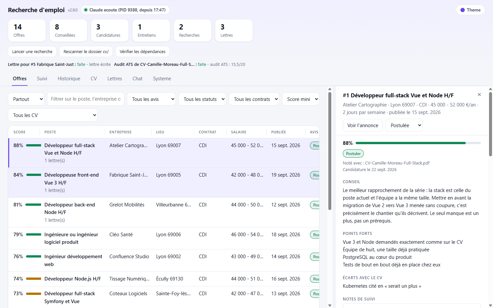
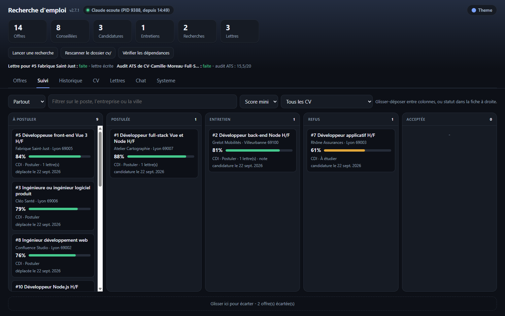
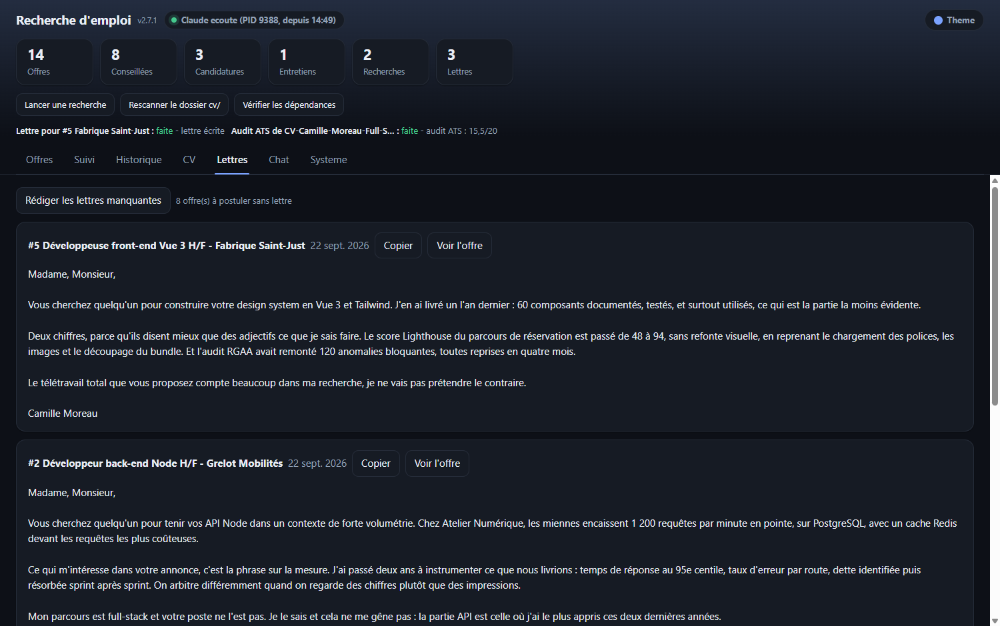
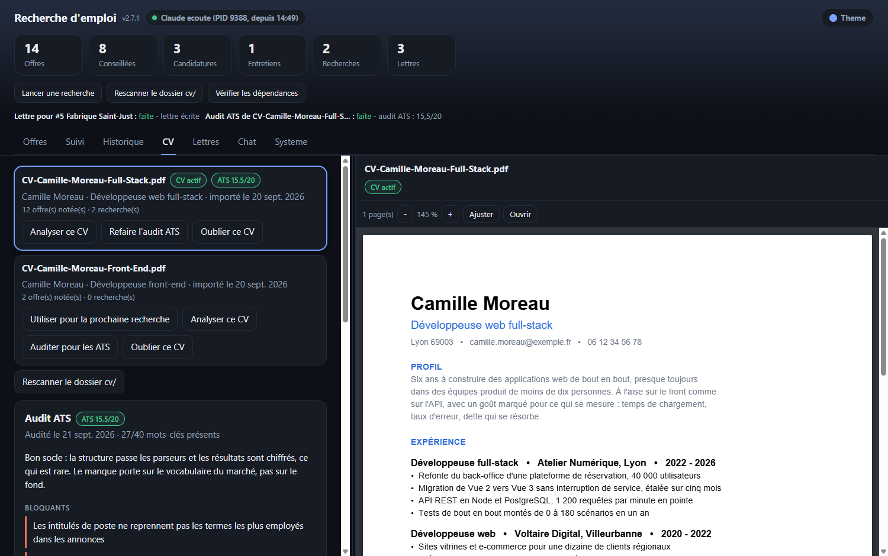
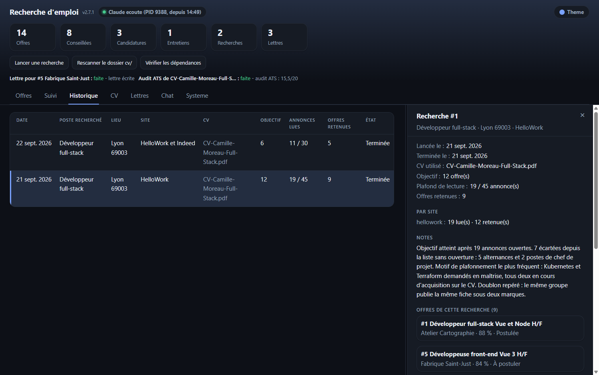
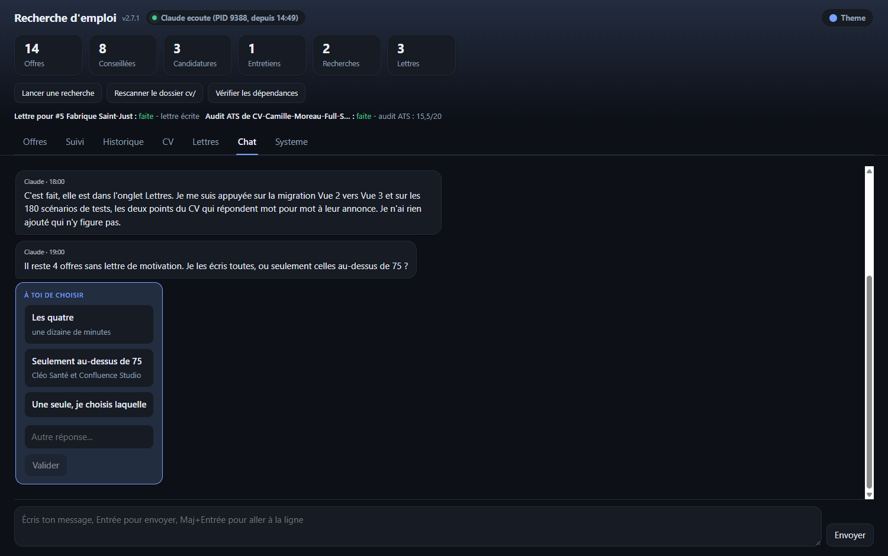
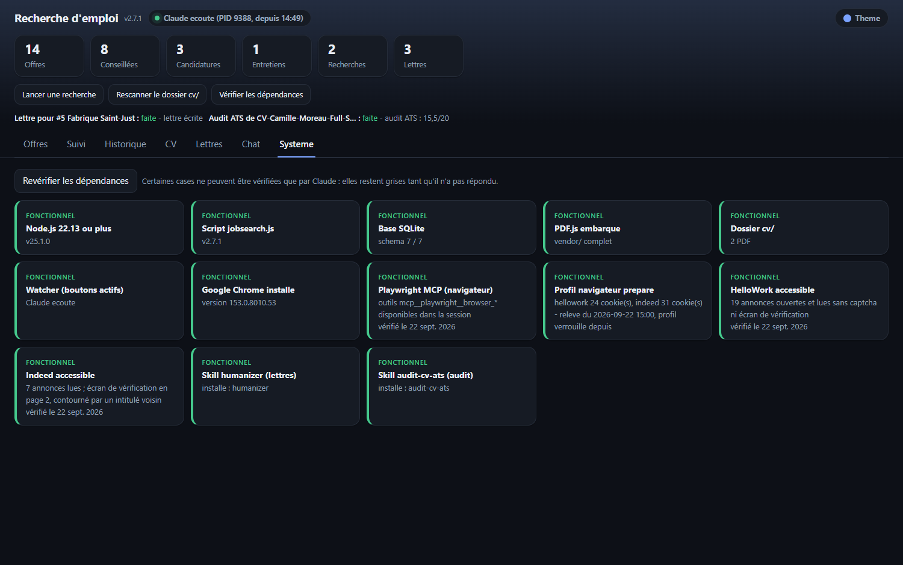
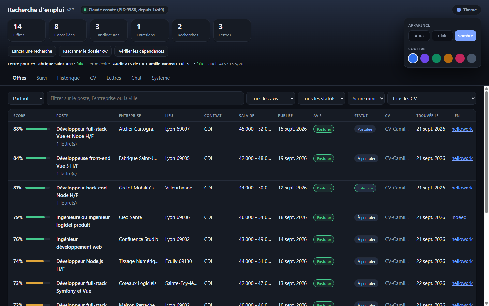
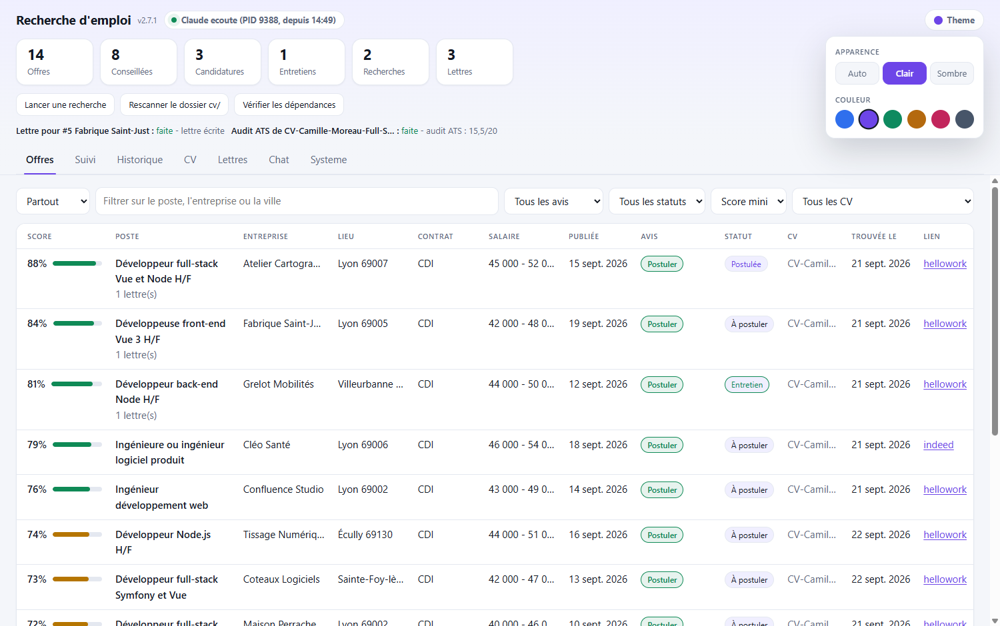

# claude-emploi

Deux skills Claude Code pour chercher un emploi en France. Le premier parcourt HelloWork et Indeed, note chaque annonce face à votre CV et tient un tableau de suivi de vos candidatures. Le second passe votre CV au crible des ATS, ces logiciels qui filtrent les candidatures avant qu'un humain les voie.

Tout tourne sur votre machine. Aucun compte à créer, aucun serveur distant, aucune donnée envoyée ailleurs que dans votre session Claude.

**Jamais installé ce genre d'outil ?** Passez par le [guide pas à pas](GUIDE-DEBUTANT.md), écrit pour quelqu'un qui n'a jamais ouvert un terminal.

> **In English.** Two French-language Claude Code skills for the French job market. `recherche-emploi` searches HelloWork and Indeed with a real browser, scores each posting against your PDF resume, stores results in a local SQLite database and serves a dashboard on `localhost:3000` with a kanban board and cover-letter drafting. `audit-cv-ats` audits a resume against applicant tracking systems and returns a score out of 20, the missing keywords and an optimised version. Everything runs locally; the skills speak French and target French job boards, so they are of limited use elsewhere.



---

## Les deux skills

**`recherche-emploi`** - Vous dites « lance ma recherche d'emploi ». Claude ouvre un vrai navigateur, cherche sur HelloWork et Indeed, lit les annonces une par une, les compare à votre CV et garde celles qui passent la barre. Vous suivez tout depuis une page web locale : la liste des offres avec leur score, le détail de chacune, un kanban pour savoir où vous en êtes, vos CV en PDF, et un chat pour parler à Claude sans quitter la page.

**`audit-cv-ats`** - Vous dites « analyse mon CV ». Claude examine le fichier comme le ferait un ATS, note six critères, vous rend une note sur 20, la liste des mots-clés qui manquent et une version corrigée du CV.

Les deux se complètent : auditez votre CV d'abord, les mots-clés manquants deviennent vos mots-clés de recherche.

---

## Pré-requis

| Il vous faut | Pourquoi | Comment vérifier |
| --- | --- | --- |
| **Claude Code** | c'est lui qui fait tourner les skills | `claude --version` dans un terminal |
| **Un abonnement Claude** | Pro ou Max, pour faire tourner les sessions | - |
| **Node.js 22.13 ou plus** | le script utilise la base SQLite intégrée à Node, disponible seulement à partir de cette version | `node --version`, voir en dessous |
| **Google Chrome** | le navigateur piloté pendant la recherche | - |
| **Playwright MCP** | ce qui permet à Claude d'ouvrir Chrome et de lire les annonces | livré avec le plugin, rien à faire |
| **Le skill `humanizer`** | pour que les lettres de motivation ne sonnent pas comme une IA | `/plugin install humanizer@claude-emploi` |
| **Le skill `audit-cv-ats`** | l'audit de CV, appelable depuis le dashboard | livré dans ce dépôt |

**Si Node manque ou est trop vieux**, Claude vous le dira au démarrage et vous proposera de l'installer. Il ne le fera pas sans votre accord : installer un runtime remplace la version déjà présente sur la machine, ce qui peut gêner d'autres projets. La commande, si vous préférez la lancer vous-même :

```bash
winget install OpenJS.NodeJS.LTS   # Windows
brew install node                  # macOS
sudo dnf install -y nodejs         # Fedora
```

Sur Debian et Ubuntu, passez par [NodeSource](https://github.com/nodesource/distributions) : la version d'`apt` est souvent trop ancienne. Dans tous les cas, ouvrez un nouveau terminal ensuite, sinon `node` reste introuvable. Si vous jonglez déjà entre plusieurs versions de Node, utilisez [nvm](https://github.com/nvm-sh/nvm) ou [fnm](https://github.com/Schniz/fnm) plutôt que d'écraser votre installation.

**Playwright MCP et `humanizer` viennent avec les plugins.** Playwright est déclaré par le plugin `recherche-emploi` : il s'installe et se lance tout seul, il faut seulement relancer Claude Code après l'installation. `humanizer` est relayé par ce marketplace mais reste le projet de [blader](https://github.com/blader/humanizer), installé depuis son dépôt d'origine.

Pour une installation manuelle des skills, sans passer par les plugins, il faut ajouter Playwright soi-même :

```bash
# macOS, Linux, WSL
claude mcp add playwright -- npx @playwright/mcp@latest --browser chrome

# Windows
claude mcp add playwright -- cmd /c npx @playwright/mcp@latest --browser chrome
```

Le navigateur reste visible pendant la recherche, c'est voulu : vous voyez ce qui se passe et vous pouvez intervenir.

**Si `humanizer` manque**, les lettres se rédigent quand même, Claude applique les règles d'écriture à la main. **Si `audit-cv-ats` manque**, seul le bouton d'audit du dashboard est inactif, le reste fonctionne. Aucun des deux n'est bloquant.

---

## Installation

### Par plugin, la façon recommandée

Dans Claude Code, trois commandes, puis une quatrième pour le skill d'écriture :

```text
/plugin marketplace add Sayn78/claude-emploi
/plugin install recherche-emploi@claude-emploi
/plugin install audit-cv-ats@claude-emploi
/plugin install humanizer@claude-emploi
```

**Relancez Claude Code ensuite** : c'est au redémarrage que les skills et le serveur Playwright deviennent actifs.

La première ajoute ce dépôt à votre liste de sources. Les suivantes installent les skills. Pour la suite, voir [Mettre à jour](#mettre-à-jour).

Si les commandes `/plugin` ne sont pas disponibles chez vous - c'est le cas de l'extension VS Code - les mêmes opérations passent par le terminal :

```bash
claude plugin marketplace add Sayn78/claude-emploi
claude plugin install recherche-emploi@claude-emploi
claude plugin install audit-cv-ats@claude-emploi
claude plugin install humanizer@claude-emploi
```

### À la main

Si vous n'utilisez pas les plugins :

```bash
git clone https://github.com/Sayn78/claude-emploi.git
cp -r claude-emploi/plugins/recherche-emploi/skills/recherche-emploi ~/.claude/skills/
cp -r claude-emploi/plugins/audit-cv-ats/skills/audit-cv-ats ~/.claude/skills/
```

Sous Windows, `%USERPROFILE%\.claude\skills\` remplace `~/.claude/skills/`.

---

## Mettre à jour

### Être prévenu automatiquement

Claude Code n'active pas les mises à jour automatiques pour les marketplaces tiers comme celui-ci. À activer une fois, sinon vous resterez sur la version installée le premier jour :

1. Tapez `/plugin`
2. Onglet **Marketplaces**
3. Sélectionnez `claude-emploi`
4. **Enable auto-update**

Claude Code vérifie ensuite les nouvelles versions au démarrage de chaque session, avec un délai aléatoire jusqu'à dix minutes, et vous demande de lancer `/reload-plugins` quand il en a trouvé une.

Pour savoir ce qui a changé, le [CHANGELOG](CHANGELOG.md) liste chaque version. Vous pouvez aussi cliquer **Watch** puis **Custom** puis **Releases** en haut de ce dépôt : GitHub vous enverra un mail à chaque publication.

### Le faire à la main

Deux étapes, l'une ne remplace pas l'autre. La première rafraîchit le catalogue, la seconde récupère le code :

```text
/plugin marketplace update claude-emploi
```

puis, dans un terminal :

```bash
claude plugin update recherche-emploi
claude plugin update audit-cv-ats
```

**Relancez Claude Code ensuite.** Le plugin déclare un serveur MCP, et un serveur MCP ne se recharge pas toujours proprement sans redémarrage. `/reload-plugins` suffit pour le reste.

Si vous préférez tout faire depuis le terminal, `claude plugin marketplace update claude-emploi` remplace la commande slash.

### Si rien ne bouge

Vérifiez la version que vous avez avec `claude plugin list`, comparez-la au [CHANGELOG](CHANGELOG.md). Une désinstallation suivie d'une réinstallation règle les cas tordus :

```bash
claude plugin uninstall recherche-emploi@claude-emploi
claude plugin install recherche-emploi@claude-emploi
```

Vos données ne risquent rien : la base SQLite, les CV et les lettres vivent dans votre dossier de travail, pas dans le plugin.

---

## Premier lancement

1. Créez un dossier de travail vide, par exemple `job-search` dans votre dossier personnel.
2. Ouvrez Claude Code dans ce dossier et tapez :

```text
/recherche-emploi
```

C'est tout. Vous n'avez rien à préparer : Claude crée le sous-dossier `cv/`, installe son script, crée la base et ouvre le dashboard sur <http://localhost:3000>. Il vous demande alors de déposer votre CV en PDF dans `cv/`, avec un bouton qui ouvre le dossier pour vous, et il attend que vous confirmiez.

Ses questions s'affichent ensuite dans le chat de la page, avec les réponses en boutons : quel CV utiliser, quel poste et quelle ville chercher, combien d'offres vous voulez garder, combien d'annonces il a le droit de lire au maximum, sur quel site chercher. Vous cliquez, vous ne tapez rien.

Deux variantes selon votre installation. Si vous avez installé par plugin, la commande devient `/recherche-emploi:recherche-emploi`. Et si vous préférez, une phrase suffit aussi : **lance ma recherche d'emploi**, ou **analyse mon CV** pour l'audit ATS.

---

## Guide d'utilisation

### Lancer une recherche

Deux nombres décident de la durée :

- **l'objectif**, le nombre d'offres que vous voulez garder. Dix est un bon départ ;
- **le plafond**, le nombre d'annonces que Claude a le droit d'ouvrir avant d'abandonner. Quarante pour dix offres gardées, c'est la bonne proportion.

Sans plafond, une recherche trop large peut tourner très longtemps. La recherche s'arrête dès que l'un des deux est atteint, et le dashboard affiche « 12/40 lues » pour que vous sachiez où ça en est.

Il vous demande aussi le **type de contrat** : CDI, CDD, alternance, stage, intérim, temps partiel, ou peu importe. Ce n'est pas déduit de votre CV, parce que ça se déduit mal : on peut avoir dix ans de métier et chercher une alternance en reconversion. Quand un contrat précis est demandé, il filtre dès la page de résultats plutôt que de dépenser votre plafond de lecture sur des annonces hors sujet, et une offre dont le contrat ne correspond pas est écartée même si elle est bonne par ailleurs.

Claude peut chercher sur HelloWork, sur Indeed, ou sur les deux. Sur les deux, il commence par HelloWork puis fait un point avant de continuer : bilan du premier site, budget restant, et vous choisissez de continuer, d'arrêter ou d'élargir.

### Lire les offres

Chaque annonce lue est notée sur 100, toujours avec la même grille :

| Critère | Points |
| --- | --- |
| Compétences | 40 |
| Expérience | 20 |
| Adéquation au poste recherché | 20 |
| Lieu | 10 |
| Conditions (contrat, salaire, diplôme) | 10 |

Une offre n'est enregistrée qu'à partir de 50 sur 100, **et** 15 sur 40 en compétences. Les autres sont comptées dans les annonces lues, avec la raison du rejet dans le récapitulatif de fin.

Dans l'onglet **Offres**, un clic sur une carte ouvre le détail à droite : description complète, salaire et date de publication quand l'annonce les donne, ce qui colle avec votre CV, ce qui manque, et un conseil en deux ou trois phrases. La largeur du panneau se règle à la souris en tirant sur la barre de séparation, et se retient d'une fois sur l'autre.

Les filtres au-dessus de la liste : par poste, par entreprise ou par ville, par avis, par statut, par type de contrat, par score minimum.

Les colonnes se redimensionnent à la souris : tirez la bordure droite d'un en-tête pour donner de la place à un intitulé trop long, double-cliquez dessus pour revenir à la largeur d'origine. Vos largeurs sont retenues d'une session à l'autre.

### Suivre ses candidatures

L'onglet **Suivi** est un kanban en cinq colonnes : À postuler, Postulée, Entretien, Refus, Acceptée. Les offres arrivent dans la première. Vous les déplacez à la souris au fur et à mesure. Une note libre par offre permet de retenir le nom d'un contact, une date de rappel ou ce qui s'est dit en entretien.



### Les lettres de motivation

Depuis le détail d'une offre, un bouton demande la lettre. Depuis l'onglet Lettres, un autre les rédige toutes d'un coup pour les offres qui n'en ont pas encore, du meilleur score au moins bon.

Une règle tient tout : **rien dans la lettre qui ne soit pas dans votre CV**. Pas d'expérience inventée, pas de diplôme ajouté, pas d'enthousiasme de commande. La lettre passe ensuite par le skill `humanizer` pour retirer les tics d'écriture d'IA.



### Les CV

Plusieurs CV peuvent cohabiter dans `cv/`. Un seul est actif à la fois, c'est celui contre lequel les offres sont notées - et le score bouge beaucoup selon le CV choisi, ce qui est bien le but quand on vise deux métiers différents.

L'onglet **CV** affiche le PDF en grand, à faire défiler, avec le texte sélectionnable. Un clic sur une carte de CV l'ouvre. Le bouton d'audit ATS lance le second skill et rapatrie la note dans le dashboard.



### Retrouver une recherche passée

L'onglet **Historique** garde une ligne par recherche : les mots-clés, le site, le CV utilisé, l'objectif, le nombre d'annonces lues sur le plafond, et les offres retenues. Le détail d'une recherche affiche aussi les notes que Claude a prises en chemin : pourquoi il a écarté telle annonce, où il a buté, ce qu'il n'a pas eu le temps de lire.



### Le chat

L'onglet **Chat** parle à la session Claude ouverte. Vous écrivez, Claude répond dans la page. Et surtout, quand Claude a une question, elle s'affiche ici avec les réponses possibles en boutons : vous cliquez et il reprend son travail. Il raconte aussi ce qu'il fait pendant une recherche longue, ce qui évite de rester devant une page qui ne bouge pas.

Une pastille en haut indique **Claude écoute** ou **Claude hors ligne**. Hors ligne, les boutons sont grisés : c'est normal, il faut une session Claude Code ouverte avec le skill lancé.



### La page des dépendances

Le bouton « Vérifier les dépendances » affiche une case par pré-requis. Vert, tout va bien. Rouge, il manque quelque chose et la case dit quoi. Gris, pas encore vérifié.

| Case rouge | Ce qu'il faut faire |
| --- | --- |
| Node.js | installer la version LTS de Node |
| Dossier cv/ | déposer au moins un CV en PDF |
| Google Chrome | installer Chrome, Playwright est configuré pour lui |
| Playwright MCP | la commande `claude mcp add` plus haut, puis relancer Claude Code |
| Watcher | lancer le skill dans une session Claude Code |
| Skill humanizer / audit-cv-ats | les installer, voir les pré-requis |
| HelloWork / Indeed | un captcha ou un écran de vérification est apparu, voir les astuces |



### Changer les couleurs

Le bouton **Theme** en haut à droite ouvre trois modes - Auto, Clair, Sombre - et six couleurs d'accent. Auto suit le réglage de votre système. Le choix est gardé dans le navigateur et appliqué avant le premier affichage, sans le clignotement habituel.

| Sombre | Clair |
| --- | --- |
|  |  |

---

## Astuces

**Commencez petit.** Dix offres pour quarante annonces lues. Vous verrez tout de suite si vos mots-clés sont les bons, et vous ajusterez avant d'y passer une heure.

**Connectez-vous une fois sur HelloWork et Indeed** dans le navigateur ouvert par Playwright. Ce n'est pas nécessaire pour chercher, mais Indeed affiche parfois un mur de connexion en deuxième page de résultats, et le profil garde vos cookies d'une session à l'autre.

**Un captcha n'est pas une panne.** Claude s'arrête et vous demande de le résoudre vous-même dans la fenêtre, puis il reprend. Il ne cherchera jamais à le contourner. Si Indeed en remet un deuxième, basculez sur HelloWork.

**Auditez votre CV avant de chercher.** Les mots-clés que l'audit signale comme manquants sont exactement ceux que les annonces emploient : ils font de bons termes de recherche.

**Plusieurs CV pour plusieurs métiers.** Une même annonce peut passer de 45 à 72 selon le CV actif. Si vous hésitez entre deux orientations, faites deux recherches avec deux CV.

**Une seule session Claude Code à la fois** sur un dossier de travail. Deux sessions ouvertes, et vos clics dans la page partent dans la mauvaise. Le skill refuse d'ailleurs de démarrer une seconde écoute et vous dit laquelle occupe la place.

**Le dashboard survit à la session.** Fermez Claude Code, la page reste consultable : offres, kanban, lettres, tout est dans la base locale. Seuls les boutons qui demandent une action à Claude deviennent inactifs.

---

## Vie privée

Votre CV, la base de données et le dashboard restent sur votre machine. Le serveur web n'écoute que sur `127.0.0.1`, il n'est pas accessible depuis votre réseau.

Ce qui sort de la machine : les pages d'annonces que le navigateur va chercher sur HelloWork et Indeed, et le contenu que Claude traite pendant la session, comme dans n'importe quelle conversation Claude Code.

---

## Ce que ces skills ne font pas

Ils ne postulent pas à votre place. Ils ne créent aucun compte, ne se connectent à aucun site, ne remplissent aucun formulaire en dehors du champ de recherche. Ils ne contournent aucun captcha ni aucune protection anti-robot. Ils n'inventent rien : un champ absent d'une annonce reste vide, et une lettre ne contient que ce qui figure dans votre CV.

La navigation se fait au rythme d'un humain, une annonce à la fois.

---

## Sous le capot

Un seul fichier JavaScript, sans aucune dépendance npm. Il utilise `node:sqlite`, la base intégrée à Node depuis la 22.13, et sert le dashboard avec le module HTTP de Node. La base se migre toute seule à chaque mise à jour, en se sauvegardant d'abord.

PDF.js est embarqué dans le dépôt pour afficher les CV sans passer par le lecteur du navigateur.

---

## Licence et crédits

MIT, voir [LICENSE](LICENSE).

- [PDF.js](https://mozilla.github.io/pdf.js/) (Mozilla Foundation), Apache 2.0. Les fichiers `scripts/vendor/` sont distribués tels quels, entête de licence comprise.
- [humanizer](https://github.com/blader/humanizer), skill tiers, à installer séparément.
- Les grilles ATS d'`audit-cv-ats` s'appuient sur le comportement documenté de Workday, Taleo, SuccessFactors, iCIMS, Greenhouse, Lever, Talentsoft, Flatchr, Teamtailor et Recruitee.

Les captures de ce README proviennent d'une base de démonstration : le CV, les entreprises et les annonces sont inventés.

Projet indépendant, sans lien avec Anthropic, HelloWork ou Indeed.
